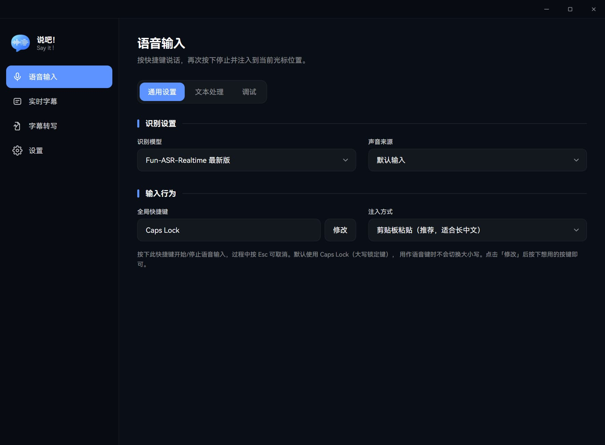
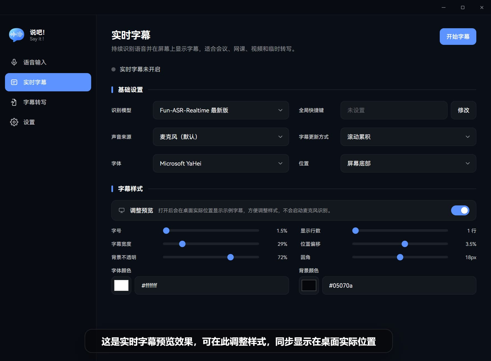
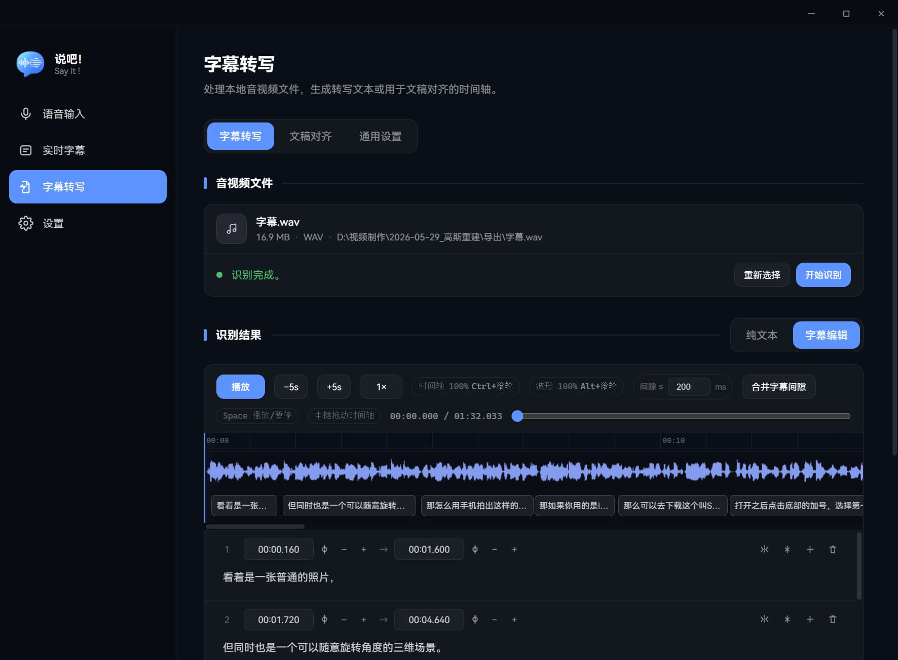
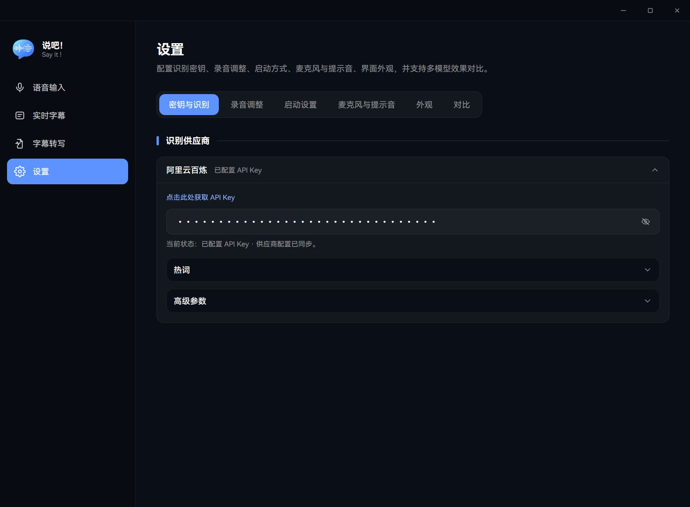

<div align="center">
  

  # 说吧！

  **按键说话，秒变文字；打开字幕，看见每一句话。**

  <p>
    <a href="#-下载">下载</a> ·
    <a href="#-使用指南">使用指南</a> ·
    <a href="#-供应商插件开发">插件开发</a> ·
    <a href="CHANGELOG.md">更新日志</a> ·
    <a href="https://github.com/henjicc/say-it/issues">问题反馈</a>
  </p>

  [](https://github.com/henjicc/say-it/releases/latest)
  [](https://github.com/henjicc/say-it/releases)
  [](LICENSE)
  [](https://github.com/henjicc/say-it/stargazers)

</div>

---

## 📖 项目介绍

说吧！是一款面向 Windows 的桌面端语音工具，覆盖按键听写、实时字幕、音视频字幕转写与文稿对齐；内置阿里云百炼能力，并可通过供应商插件扩展新的语音服务，基于 Tauri 2 构建。

## 🧩 供应商插件开发

说吧！支持以 JavaScript 供应商插件扩展新的语音识别模型。用户可在「设置 → 插件管理」中选择或拖入本地 `.sayit` 插件包安装；应用会校验插件包和签名，并明确提示需要额外信任的来源。插件通过清单声明能力、网络访问与登录会话需求，由应用后端统一管理音频、会话和运行时边界；开发者无需修改应用核心代码即可接入符合规范的供应商。

- 开发工作流与打包签名要求：[`adapt-sayit-provider`](.codex/skills/adapt-sayit-provider/SKILL.md)
- 插件 API、清单字段与运行时契约：[插件接口规范](.codex/skills/adapt-sayit-provider/references/plugin-api.md)

## ✨ 0.4.0 版本亮点

- **供应商插件扩展**：支持安装统一 `.sayit` 插件包，让新的供应商模型可按声明接入实时听写、实时字幕、文件转写或字幕翻译；插件的网络、登录会话与权限均受应用后端约束。
- **语音输入更灵活**：支持实时 / 非实时识别，以及点按切换和长按说话两种全局快捷键方式；识别结果可自动注入当前光标位置。
- **实时字幕支持双语与 OBS**：可采集麦克风或系统输出，实时显示原文与译文；可切换输出至桌面悬浮窗或 OBS Browser Source，适合会议、直播、网课和视频场景。
- **新增字幕转写与字幕编辑器**：导入本地音视频文件后可生成纯文本或字幕，支持播放、跳转、拆分、合并、插入、删除与波形时间轴编辑。
- **新增文稿对齐**：把现成文稿与识别时间轴自动对齐，输出更适合字幕使用的时间轴结果，并支持导出 SRT。
- **模型对比与音频调校**：在设置中快速对比内置及已安装插件模型的识别效果，并提供降噪、响度、均衡器试听与调节。
- **桌面运行更可靠**：识别会话、插件凭据与模型对比等关键流程由 Rust 后端统一管理，改善停止录音时的尾部音频处理、资源释放与错误反馈。

## 🖼️ 界面预览

<div align="center">
  
  
</div>

<div align="center">
  
  
</div>

## 📥 下载

<div align="center">

### 最新版本

[](https://github.com/henjicc/say-it/releases/latest)

[查看全部版本与更新记录](https://github.com/henjicc/say-it/releases)

</div>

### 下载方式

| 平台 | 文件类型 | 下载地址 |
|---|---|---|
| Windows | `.exe`（NSIS 安装包） | [前往最新版本](https://github.com/henjicc/say-it/releases/latest) |
| macOS | — | 计划中 |
| Linux | — | 计划中 |

### 安装说明

- **Windows**：下载 `.exe` 安装包并运行，按向导完成安装。
- **macOS / Linux**：暂未支持，详见[路线图](#-路线图)。

> Windows 启动时遇到 WebView 相关错误，可尝试安装 [Microsoft Edge WebView2 Runtime](https://developer.microsoft.com/microsoft-edge/webview2/)。

## 目录

- [说吧！](#说吧)
  - [📖 项目介绍](#-项目介绍)
  - [🧩 供应商插件开发](#-供应商插件开发)
  - [✨ 0.4.0 版本亮点](#-040-版本亮点)
  - [🖼️ 界面预览](#️-界面预览)
  - [📥 下载](#-下载)
    - [最新版本](#最新版本)
    - [下载方式](#下载方式)
    - [安装说明](#安装说明)
  - [目录](#目录)
  - [🚀 使用指南](#-使用指南)
    - [语音输入](#语音输入)
    - [实时字幕](#实时字幕)
    - [字幕转写](#字幕转写)
    - [文稿对齐](#文稿对齐)
    - [文本处理与热词](#文本处理与热词)
    - [供应商插件](#供应商插件)
  - [📝 更新日志](#-更新日志)
  - [💻 系统要求](#-系统要求)
    - [支持平台](#支持平台)
  - [🧩 技术栈](#-技术栈)
  - [🛠️ 开发指南](#️-开发指南)
    - [环境要求](#环境要求)
    - [获取源码](#获取源码)
    - [安装依赖](#安装依赖)
    - [启动开发环境](#启动开发环境)
    - [构建项目](#构建项目)
  - [📁 项目结构](#-项目结构)
  - [🗺️ 路线图](#️-路线图)
  - [❓ 常见问题](#-常见问题)
  - [📄 许可证](#-许可证)

## 🚀 使用指南

### 语音输入

1. 打开设置，配置阿里云百炼 API Key；如使用其他供应商，先安装并配置对应插件。
2. 在「语音输入」页选择识别模型、声音来源、注入方式和全局快捷键。
3. 将光标定位到任意可输入文字的地方。
4. 按所选方式点按快捷键开始/停止，或长按说话、松开停止；识别结果会自动注入到当前光标位置。

### 实时字幕

1. 打开「实时字幕」面板，选择识别模型与声音来源。
2. 需要识别本机播放声音时，选择输出设备（Loopback 采集）。
3. 调整字幕字体、位置、宽度、显示行数和配色后启动字幕。
4. 可按需开启翻译，并选择输出到独立悬浮窗或 OBS Browser Source，用于会议、视频、网课和直播场景。

### 字幕转写

1. 打开「字幕转写」并选择本地音视频文件。
2. 选择适合的非实时识别模型后开始识别。
3. 识别完成后可查看纯文本，或进入字幕编辑器精修时间轴与文本。
4. 编辑器支持波形、时间轴缩放、拆分、合并字幕间隙、插入、删除与播放控制。

### 文稿对齐

1. 在「文稿对齐」页导入音视频文件并粘贴已有文稿。
2. 使用带时间戳的识别模型生成基准时间轴。
3. 运行对齐后可在“完全按文稿”与“识别修正”两套结果之间切换。
4. 完成后可导出 SRT，适合已有讲稿、旁白稿或字幕修订场景。

### 文本处理与热词

- 在「语音输入 → 文本处理」中可配置本地查找替换规则，并支持中英文自动加空格等内置规则。开启智能处理时先由大语言模型处理，再执行本地规则。
- 在「热词上下文」中维护一份全局热词与上下文，提升专有名词、人名和术语的识别准确率：支持热词的模型收到带权重的词表，支持上下文的模型收到渲染后的文本，需要预先建词表的供应商可一键同步到云端。
- 在「设置 → 对比」中可对同一段录音做多模型识别对比，帮助挑选更合适的模型。

### 供应商插件

1. 在「设置 → 插件管理」中点击「安装插件」，或将本地 `.sayit` 文件拖入应用窗口。
2. 查看插件声明的权限；未签名或签名密钥未受信任时，仅在确认来源可靠后继续安装。
3. 安装后在「密钥与识别」中完成该插件要求的密钥或登录配置，再到对应功能页选择其模型。

> 卸载插件会同时删除其配置、登录会话、Cookie 与浏览数据，且无法恢复。

## 📝 更新日志

完整更新记录见 [CHANGELOG.md](CHANGELOG.md)。GitHub Releases 会自动显示对应版本的更新日志。

## 💻 系统要求

| 项目 | 最低要求 | 推荐配置 |
|---|---|---|
| 操作系统 | Windows 10 21H2 及以上 | Windows 11 |
| 内存 | 4 GB | 8 GB 及以上 |
| 存储空间 | 200 MB | 500 MB |
| 其他 | 麦克风设备、网络连接（用于调用语音识别服务） | 独立降噪麦克风 |

### 支持平台

- [x] Windows
- [ ] macOS（计划中）
- [ ] Linux（计划中）

## 🧩 技术栈

- **应用框架**：Tauri 2
- **前端框架**：React 19 + TypeScript + Vite 6 + Tailwind CSS 4
- **状态管理**：Zustand
- **后端语言**：Rust（2021 edition）
- **音频处理**：cpal（采集）、nnnoiseless（RNNoise 降噪）、ebur128（响度分析）、自研 DSP
- **语音识别**：内置阿里云百炼 FunASR / Qwen3-ASR（实时识别、文件转写、热词与多模型对比），支持 JavaScript 供应商插件扩展
- **其他依赖**：enigo（文本注入）、arboard（剪贴板）、tauri-plugin-autostart（开机自启）

## 🛠️ 开发指南

### 环境要求

- Node.js：18 及以上（配合 Vite 6）
- Rust 工具链：稳定版（2021 edition）
- 包管理器：npm

### 获取源码

```bash
git clone https://github.com/henjicc/say-it.git
cd say-it
```

### 安装依赖

```bash
npm install
```

### 启动开发环境

```bash
# 仅前端界面（不含 Tauri 后端能力）
npm run ui:dev

# 完整桌面应用（推荐）
npm run tauri:dev
```

> 前端开发端口固定为 `5155`，与 `tauri.conf.json` 中的 `devUrl` 对应，请勿占用。

### 构建项目

```bash
npm run tauri:build
```

构建产物位于：

```text
src-tauri/target/release/bundle/nsis/
```

## 📁 项目结构

```text
say-it/
├── ui/                     # 前端 React 应用
│   ├── index.html          # 主窗口入口
│   ├── indicator.html      # 悬浮指示窗口入口
│   └── src/
│       ├── components/     # 通用 UI 组件
│       ├── views/          # 功能页面（语音输入、实时字幕、字幕转写、设置等）
│       ├── features/       # 业务逻辑（听写、字幕、转写、音频控制器）
│       ├── store/          # Zustand 状态
│       └── lib/            # Tauri 调用封装
├── src-tauri/              # Rust 后端
│   └── src/
│       ├── commands/       # 前端可调用的 Tauri 命令
│       ├── desktop/        # 窗口、托盘、系统音频等桌面能力
│       └── providers/      # 内置服务商与供应商插件运行时
├── docs/                   # 项目文档与经验记录
├── README.md
├── CHANGELOG.md
└── LICENSE
```

## 🗺️ 路线图

- [x] Windows 桌面版
- [x] 语音输入（实时 / 非实时）
- [x] 实时字幕
- [x] 字幕转写与字幕编辑
- [x] 文稿对齐与 SRT 导出
- [x] 本地文本处理规则、热词定制、多模型对比
- [x] 供应商插件安装与模型扩展
- [ ] macOS / Linux 支持
- [ ] 更多语音识别服务商接入

## ❓ 常见问题

<details>
<summary><strong>按快捷键说话没有反应怎么办？</strong></summary>

请检查：设置中是否已正确配置阿里云百炼 API Key；系统是否已授予麦克风权限；快捷键是否与其他软件冲突（可在设置中更换快捷键）。

</details>

<details>
<summary><strong>实时字幕为什么可以选择“输出设备”而不只是麦克风？</strong></summary>

实时字幕支持采集系统正在播放的声音（Loopback），而不仅仅是麦克风输入，因此可以为视频、网课等本机播放的音频生成字幕，无需外放让麦克风“听”。

</details>

<details>
<summary><strong>字幕转写和实时字幕应该怎么选？</strong></summary>

实时字幕适合边听边看、追求即时反馈；字幕转写适合导入本地音视频文件后再精修结果、导出字幕或继续做文稿对齐。

</details>

<details>
<summary><strong>Windows 启动报 WebView 相关错误怎么办？</strong></summary>

请安装 [Microsoft Edge WebView2 Runtime](https://developer.microsoft.com/microsoft-edge/webview2/) 后重试。

</details>

## 📄 许可证

本项目采用 [MIT](LICENSE) 开源许可证。

---

<div align="center">

如果这个项目对你有帮助，可以给它一个 Star。

**说吧！ · 说了就写好了**

</div>
