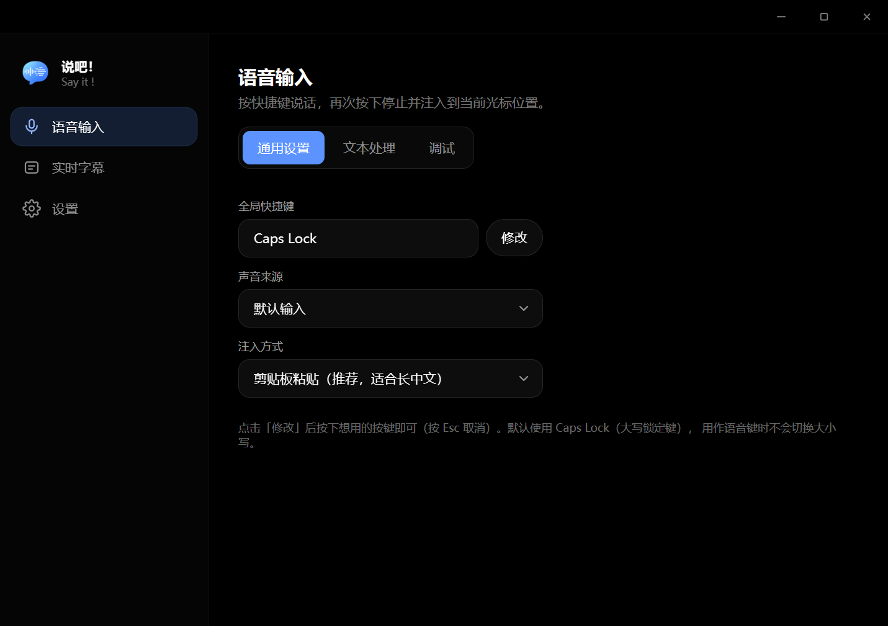
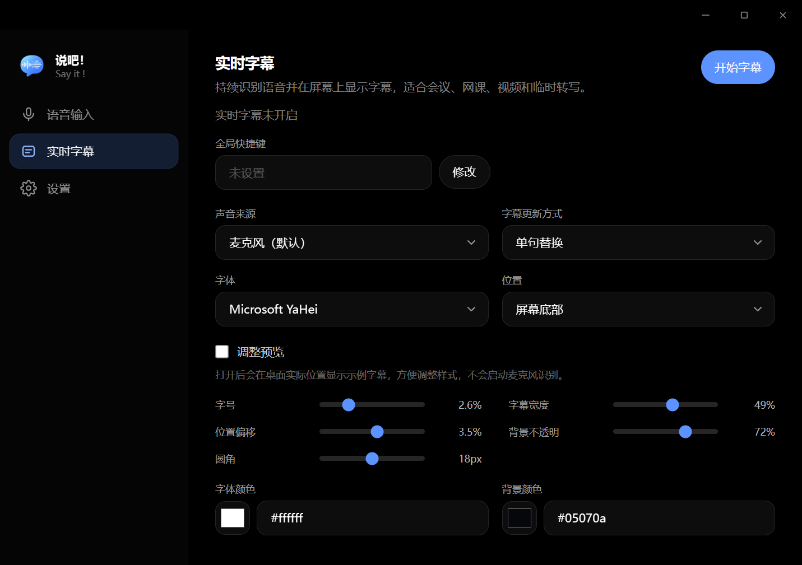
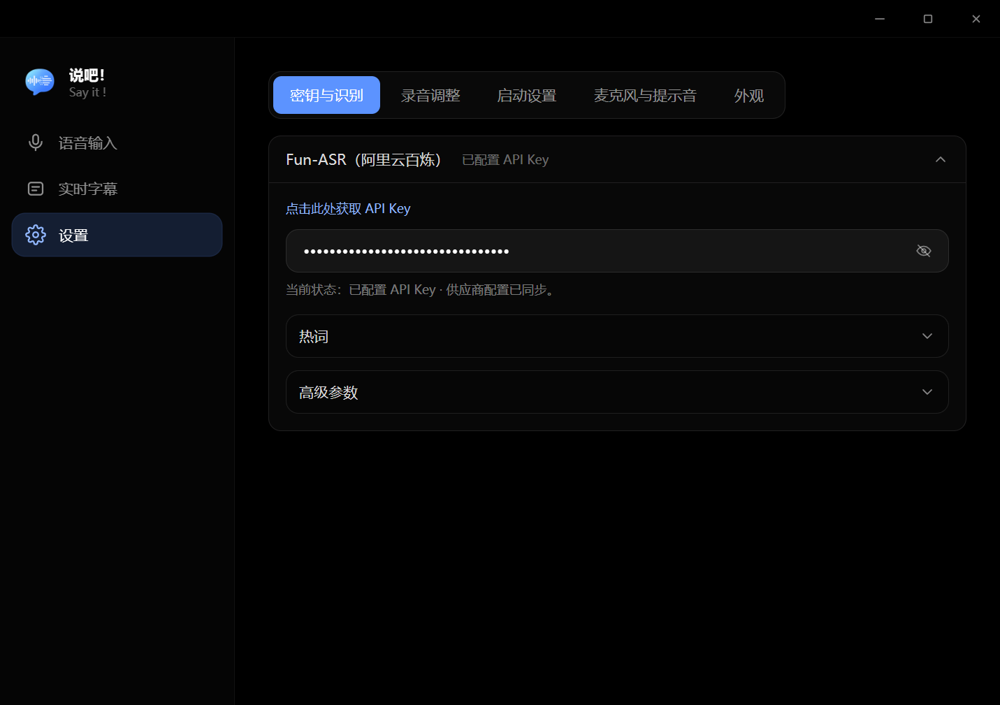

<div align="center">
  

  # 说吧！

  **按键说话，秒变文字；打开字幕，看见每一句话。**

  <p>
    <a href="#-下载">下载</a> ·
    <a href="#-使用指南">使用指南</a> ·
    <a href="https://github.com/henjicc/say-it/issues">问题反馈</a>
  </p>

  [](https://github.com/henjicc/say-it/releases/latest)
  [](https://github.com/henjicc/say-it/releases)
  [](LICENSE)
  [](https://github.com/henjicc/say-it/stargazers)

</div>

---

## 📖 项目介绍

说吧！是一款 Windows 桌面端语音输入与实时字幕工具，基于 Tauri 2 构建，主要用于日常打字听写和会议/网课的实时转写。

它希望解决以下问题：

- 打字慢、长文本输入效率低，希望用说话代替打字
- 会议、网课、视频没有字幕，只能靠听，容易错过关键信息
- 通用听写工具对专业术语、人名识别不准，需要能自定义热词的方案

适合以下用户：

- 需要高频输入长文本的写作者、客服、内容创作者
- 需要给会议、网课、视频加实时字幕的用户
- 希望在识别结果里自动做文本替换/清理（如去口癖、统一术语）的用户

> 当前状态：开发中（版本 0.1.0）

## ✨ 主要功能

- **语音输入（听写）**：按下快捷键说话，再次按下即停止，识别结果自动注入到当前光标所在位置，默认快捷键为 Caps Lock
- **实时字幕**：持续识别语音并在屏幕上显示字幕，声音来源可选麦克风或系统输出（Loopback 采集），适合会议、网课、视频和临时转写
- **本地文本处理规则**：对识别结果按顺序做正则查找替换，规则在独立线程运行并带超时保护，写错正则也不会卡住听写
- **热词定制**：基于阿里云 FunASR 热词表管理专有名词、人名等词汇，提升识别准确率
- **音频降噪与试听**：内置 RNNoise 降噪和两段搁架均衡器，可在设置里直接 A/B 试听「原始 vs 处理后」效果
- **外观与启动**：自定义主题强调色，支持开机自启动

## 🖼️ 界面预览

<div align="center">
  
  
  
</div>

## 📥 下载

<div align="center">

### 最新版本

[](https://github.com/henjicc/say-it/releases/latest)

[查看全部版本与更新记录](https://github.com/henjicc/say-it/releases)

</div>

### 下载方式

| 平台 | 文件类型 | 下载地址 |
|---|---|---|
| Windows | `.exe`（NSIS 安装包） | [前往最新版本](https://github.com/henjicc/say-it/releases/latest) |
| macOS | — | 计划中 |
| Linux | — | 计划中 |

### 安装说明

- **Windows**：下载 `.exe` 安装包并运行，按向导完成安装。
- **macOS / Linux**：暂未支持，详见[路线图](#-路线图)。

> Windows 启动时遇到 WebView 相关错误，可尝试安装 [Microsoft Edge WebView2 Runtime](https://developer.microsoft.com/microsoft-edge/webview2/)。

## 目录

- [项目介绍](#-项目介绍)
- [主要功能](#-主要功能)
- [界面预览](#-界面预览)
- [下载](#-下载)
- [使用指南](#-使用指南)
- [系统要求](#-系统要求)
- [技术栈](#-技术栈)
- [开发指南](#-开发指南)
- [项目结构](#-项目结构)
- [路线图](#-路线图)
- [常见问题](#-常见问题)
- [贡献](#-贡献)
- [许可证](#-许可证)
- [相关链接](#-相关链接)

## 🚀 使用指南

### 语音输入

1. 打开设置，配置阿里云语音识别服务的 API Key
2. 将光标定位到任意可输入文字的地方
3. 按下快捷键（默认 Caps Lock）开始说话
4. 再次按下快捷键停止，识别结果会自动注入到光标位置

### 实时字幕

1. 打开「实时字幕」面板，选择声音来源（麦克风或系统输出设备）
2. 按下字幕快捷键开启，屏幕上会出现悬浮字幕窗口
3. 可在设置中调整字幕位置、字体和外观
4. 再次按下快捷键关闭字幕

### 文本处理规则

在「语音输入 → 文本处理」中添加正则查找替换规则，识别结果会按规则顺序自动处理，替换内容留空即为删除该匹配内容。

## 💻 系统要求

| 项目 | 最低要求 | 推荐配置 |
|---|---|---|
| 操作系统 | Windows 10 21H2 及以上 | Windows 11 |
| 内存 | 4 GB | 8 GB 及以上 |
| 存储空间 | 200 MB | 500 MB |
| 其他 | 麦克风设备、网络连接（用于调用语音识别服务） | 独立降噪麦克风 |

### 支持平台

- [x] Windows
- [ ] macOS（计划中）
- [ ] Linux（计划中）

## 🧩 技术栈

- **应用框架**：Tauri 2
- **前端框架**：React 19 + TypeScript + Vite 6 + Tailwind CSS 4
- **状态管理**：Zustand
- **后端语言**：Rust（2021 edition）
- **音频处理**：cpal（采集）、nnnoiseless（RNNoise 降噪）、ebur128（响度分析）、自研 DSP
- **语音识别**：阿里云 FunASR（WebSocket 实时识别 + 热词定制）
- **其他依赖**：enigo（文本注入）、arboard（剪贴板）、tauri-plugin-autostart（开机自启）

## 🛠️ 开发指南

### 环境要求

- Node.js：18 及以上（配合 Vite 6）
- Rust 工具链：稳定版（2021 edition）
- 包管理器：npm

### 获取源码

```bash
git clone https://github.com/henjicc/say-it.git
cd say-it
```

### 安装依赖

```bash
npm install
```

### 启动开发环境

```bash
# 仅前端界面（不含 Tauri 后端能力）
npm run ui:dev

# 完整桌面应用（推荐）
npm run tauri:dev
```

> 前端开发端口固定为 `5155`，与 `tauri.conf.json` 中的 `devUrl` 对应，请勿占用。

### 构建项目

```bash
npm run tauri:build
```

构建产物位于：

```text
src-tauri/target/release/bundle/nsis/
```

## 📁 项目结构

```text
say-it/
├── ui/                     # 前端 React 应用
│   ├── index.html          # 主窗口入口
│   ├── indicator.html      # 悬浮指示窗口入口
│   └── src/
│       ├── components/     # 通用 UI 组件
│       ├── views/          # 功能页面（语音输入、实时字幕、设置等）
│       ├── features/       # 业务逻辑（听写、字幕、音频控制器）
│       ├── store/          # Zustand 状态
│       └── lib/            # Tauri 调用封装
├── src-tauri/              # Rust 后端
│   └── src/
│       ├── commands/       # 前端可调用的 Tauri 命令
│       ├── desktop/        # 窗口、托盘、系统音频等桌面能力
│       └── providers/      # 语音识别服务商对接（阿里云 FunASR）
├── docs/                   # 项目文档与经验记录
├── README.md
└── LICENSE
```

## 🗺️ 路线图

- [x] Windows 桌面版
- [x] 语音输入（听写）
- [x] 实时字幕
- [x] 本地文本处理规则与热词定制
- [ ] macOS / Linux 支持
- [ ] 更多语音识别服务商接入

## ❓ 常见问题

<details>
<summary><strong>按快捷键说话没有反应怎么办？</strong></summary>

请检查：设置中是否已正确配置阿里云语音识别服务的 API Key；系统是否已授予麦克风权限；快捷键是否与其他软件冲突（可在设置中更换快捷键）。

</details>

<details>
<summary><strong>实时字幕为什么可以选择"输出设备"而不只是麦克风？</strong></summary>

实时字幕支持采集系统正在播放的声音（Loopback），而不仅仅是麦克风输入，因此可以为视频、网课等本机播放的音频生成字幕，无需外放让麦克风"听"。

</details>

<details>
<summary><strong>Windows 启动报 WebView 相关错误怎么办？</strong></summary>

请安装 [Microsoft Edge WebView2 Runtime](https://developer.microsoft.com/microsoft-edge/webview2/) 后重试。

</details>

## 🤝 贡献

欢迎提交 Issue、功能建议和 Pull Request。

1. Fork 本仓库
2. 创建功能分支：`git checkout -b feature/your-feature`
3. 提交修改：`git commit -m "添加某项功能"`
4. 推送分支：`git push origin feature/your-feature`
5. 创建 Pull Request

## 📄 许可证

本项目采用 [MIT](LICENSE) 开源许可证。

## 🔗 相关链接

- **最新版本**：https://github.com/henjicc/say-it/releases/latest
- **全部版本**：https://github.com/henjicc/say-it/releases
- **问题反馈**：https://github.com/henjicc/say-it/issues
- **功能建议**：https://github.com/henjicc/say-it/discussions
- **作者主页**：https://github.com/henjicc

## 🙏 致谢

感谢以下开源项目：

- [Tauri](https://tauri.app/)
- [React](https://react.dev/)
- [nnnoiseless（RNNoise）](https://github.com/jneem/nnnoiseless)
- 阿里云语音识别（FunASR）服务
- 所有提交反馈、建议与代码贡献的用户

---

<div align="center">

如果这个项目对你有帮助，可以给它一个 Star。

**说吧！ · 说了就写好了**

</div>
